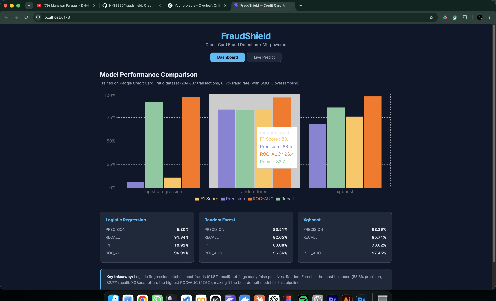

# FraudShield


> End-to-end credit card fraud detection system with ML models, a FastAPI backend, and a live React dashboard.

---

## Demo



---

## Features

- **Three classification models** — Logistic Regression, Random Forest, XGBoost
- **SMOTE oversampling** — handles extreme class imbalance (0.17% fraud rate)
- **Live prediction API** — score individual or batch transactions in real time
- **Interactive dashboard** — visualizes model metrics with Recharts
- **MLflow tracking** — experiment logging and comparison
- **REST API** — clean versioned endpoints (`/api/v1/predict`, `/api/v1/models`)

---

## Architecture

```
┌──────────────┐     ┌────────────────┐     ┌──────────────────┐
│  React SPA   │────▶│  FastAPI Server │────▶│  XGBoost Model   │
│  (Vite + TS) │     │  (uvicorn)     │     │  (joblib .pkl)   │
└──────────────┘     └────────────────┘     └──────────────────┘
  :5173                  :8000                   models/
  Dashboard              /api/v1/predict          scaler.pkl
  LivePredict            /api/v1/models           metrics.json
                         /health
```

---

## Tech Stack

| Layer      | Technology                                  |
|------------|---------------------------------------------|
| ML         | Python, Scikit-learn, XGBoost, Pandas, SMOTE |
| Backend    | FastAPI, uvicorn, Pydantic, joblib           |
| Frontend   | React 19, TypeScript, Vite, Recharts, Axios |
| Tracking   | MLflow                                      |
| DevOps     | Docker (optional)                           |

---

## Project Structure

```
fraudshield/
├── backend/
│   ├── api/
│   │   ├── __init__.py        # FastAPI app + CORS
│   │   └── routes.py          # /predict, /predict/batch, /models
│   ├── models/
│   │   ├── train.py           # Training pipeline (SMOTE + 3 classifiers)
│   │   └── predict.py         # FraudPredictor inference wrapper
│   └── requirements.txt
├── frontend/
│   ├── src/
│   │   ├── pages/
│   │   │   ├── Dashboard.tsx   # Model metrics bar chart + cards
│   │   │   └── LivePredict.tsx # Transaction fraud scoring form
│   │   └── services/
│   │       └── api.ts          # Axios client for backend
│   └── package.json
├── notebooks/
│   ├── 01_exploratory_analysis.ipynb
│   └── 02_model_training.ipynb
├── screenshots/                # Dashboard & demo screenshots
├── models/                     # Trained .pkl files (gitignored)
├── data/                       # Datasets (gitignored)
└── .gitignore
```

---

## Quick Start

### Prerequisites

- Python 3.10+
- Node.js 18+ and npm
- Kaggle Credit Card Fraud Detection dataset — [download](https://www.kaggle.com/datasets/mlg-ulb/creditcardfraud) and place as `data/raw/creditcard.csv`

### 1. Train Models

```bash
cd backend
pip install -r requirements.txt
python models/train.py
```

This runs SMOTE, trains all three models, saves `.pkl` files to `models/`, and logs to MLflow.

### 2. Start the API

```bash
cd backend
PYTHONPATH=$PWD uvicorn api:app --reload
```

API runs at `http://localhost:8000`. Docs at `http://localhost:8000/docs`.

### 3. Start the Frontend

```bash
cd frontend
npm install
npm run dev
```

Open `http://localhost:5173`.

---

## API Endpoints

| Method | Endpoint              | Description                        |
|--------|-----------------------|------------------------------------|
| GET    | `/health`             | Health check                       |
| POST   | `/api/v1/predict`     | Predict fraud for a single transaction |
| POST   | `/api/v1/predict/batch` | Predict fraud for multiple transactions |
| GET    | `/api/v1/models`      | List trained models and their metrics |

### Example Request

```json
POST /api/v1/predict
{
  "time": 0.0,
  "v1": -1.359807, "v2": -0.072781, "v3": 2.536347, "v4": 1.378155,
  "v5": -0.338321, "v6": 0.462388, "v7": 0.239599, "v8": 0.098698,
  "v9": 0.363787, "v10": 0.090794, "v11": -0.551600, "v12": -0.617801,
  "v13": -0.991390, "v14": -0.311169, "v15": 1.468177, "v16": -0.470401,
  "v17": 0.207971, "v18": 0.025791, "v19": 0.403993, "v20": 0.251412,
  "v21": -0.018307, "v22": 0.277838, "v23": -0.110474, "v24": 0.066928,
  "v25": 0.128539, "v26": -0.189115, "v27": 0.133558, "v28": -0.021053,
  "amount": 149.62
}
```

### Response

```json
{
  "fraud_probability": 0.0012,
  "prediction": 0,
  "model": "xgboost"
}
```

---

## Model Performance

| Model                | Precision | Recall  | F1     | ROC-AUC |
|----------------------|-----------|---------|--------|---------|
| Logistic Regression  | 5.8%      | 91.8%   | 0.109  | 0.970   |
| Random Forest        | 83.5%     | 82.7%   | 0.831  | 0.964   |
| XGBoost              | 68.3%     | 85.7%   | 0.760  | 0.975   |

**Default model:** XGBoost — highest ROC-AUC (97.5%) with strong recall-precision tradeoff after threshold tuning.

> Logistic Regression catches most frauds (91.8% recall) but generates excessive false positives. Random Forest is the most balanced. XGBoost offers the best overall ranking capability.

---

## Dataset

Kaggle [Credit Card Fraud Detection](https://www.kaggle.com/datasets/mlg-ulb/creditcardfraud) — 284,807 transactions, 492 fraudulent (0.172%). Features V1–V28 are PCA-transformed; Time and Amount are raw.

---

## Key Takeaways

- **Class imbalance is the core challenge** — SMOTE and class weighting were essential for meaningful recall
- **Simple models have limits** — Logistic Regression catches fraud but drowns ops in false positives
- **Ensemble methods scale better** — RF and XGBoost balance detection rate with operational cost
- **Full-stack ML matters** — training a model is only half the problem; serving it through a real API + dashboard makes it usable

---

## License

MIT

---

Built by [Nirav Sayanja](https://github.com/N-S8990)
